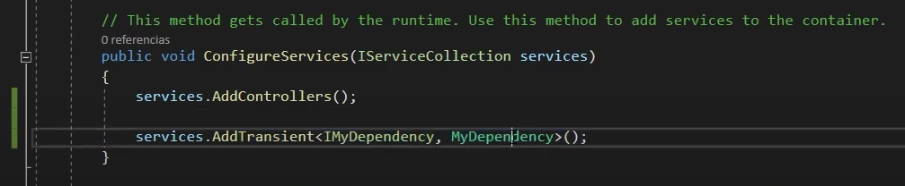
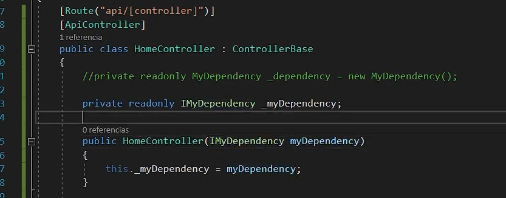

# Inyeccion de Dependencias
---
- Diagrama Solid

- La inyeccion de depdendencias resuelve una problematica principal, el Principio de inversion (Principio SOLID).

- Se crean varias clases a utilizar en un contenedor y el contenedor es el encargado de inyectarlas al sistema
- El flujo de la aplicacion se invierte
- Existen motores para administrar la inyeccion de depedencias(Autofac,dryloc,Unity,etc).

- La Inyección de Dependencias es una técnica que se utiliza para poder invertir las dependencias, pero el uso de la inyección no hace que automáticamente se puedan invertir.

-Ejemplo en Net Core

-Net core tiene integrado el framework para manejar la I. De Dependencias
-El IserviceColecction es el contenedor de la aplicacion

-Se agrega un servicio addTransient pasandole el servicio (Interfaz) y la implementacion la cual en un futuro puede cambiar por ej de base de datos.

-Cada vez que se llame el servicio se creara una instancia de la implementacion.

-Se crea una varaible privada de solo lectura en el controlador del tipo servicio que queramos usar (Interfaz).

-En el constructor le pasamos por parametro el servicio quedando instanciado y listo para ocuparlo