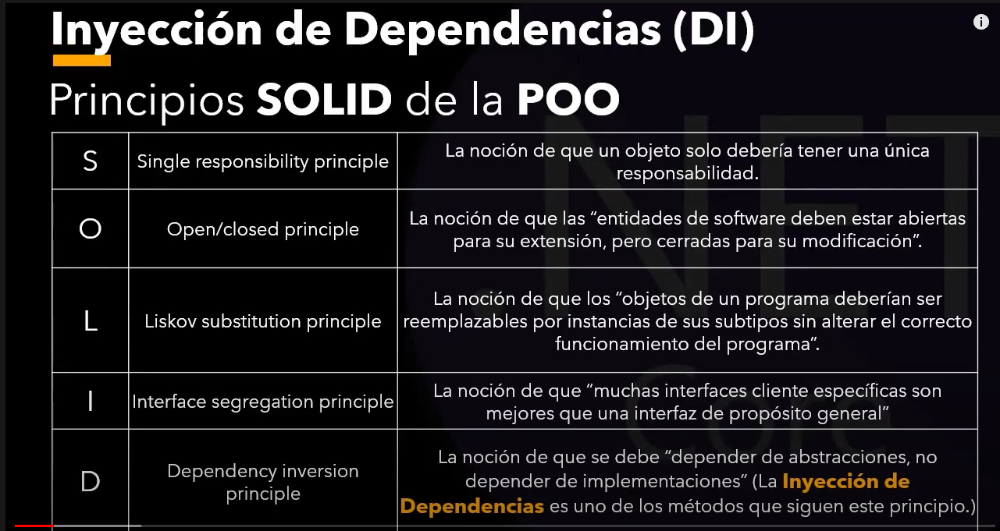

# Inyeccion de Dependencias
---
- Diagrama Solid

- La inyeccion de depdendencias resuelve una problematica principal, el Principio de inversion (Principio SOLID).

- La Inyección de Dependencias es una técnica que se utiliza para poder invertir las dependencias, pero el uso de la inyección no hace que automáticamente se puedan invertir.

